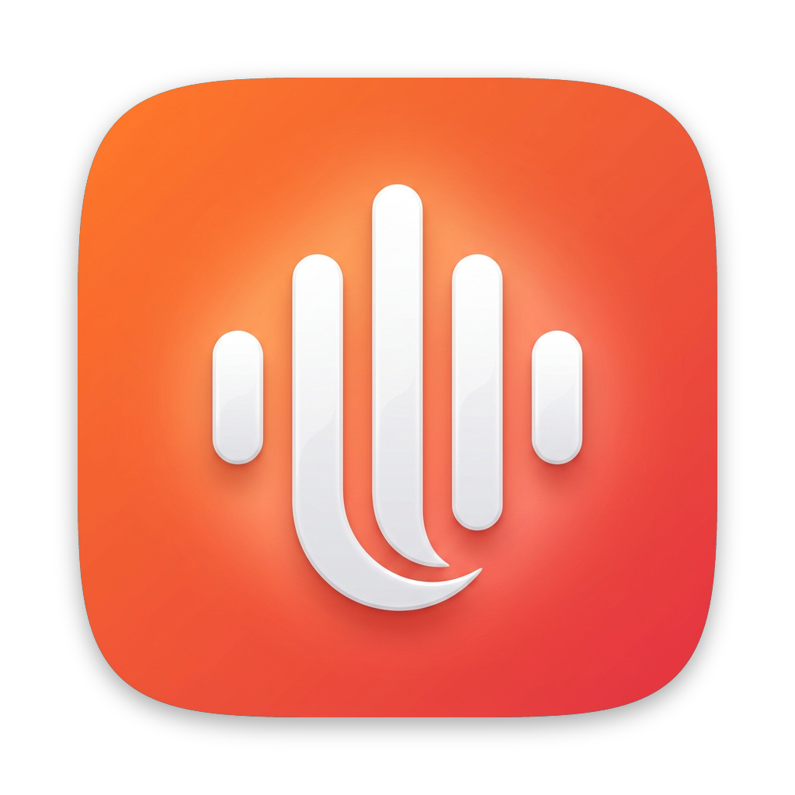
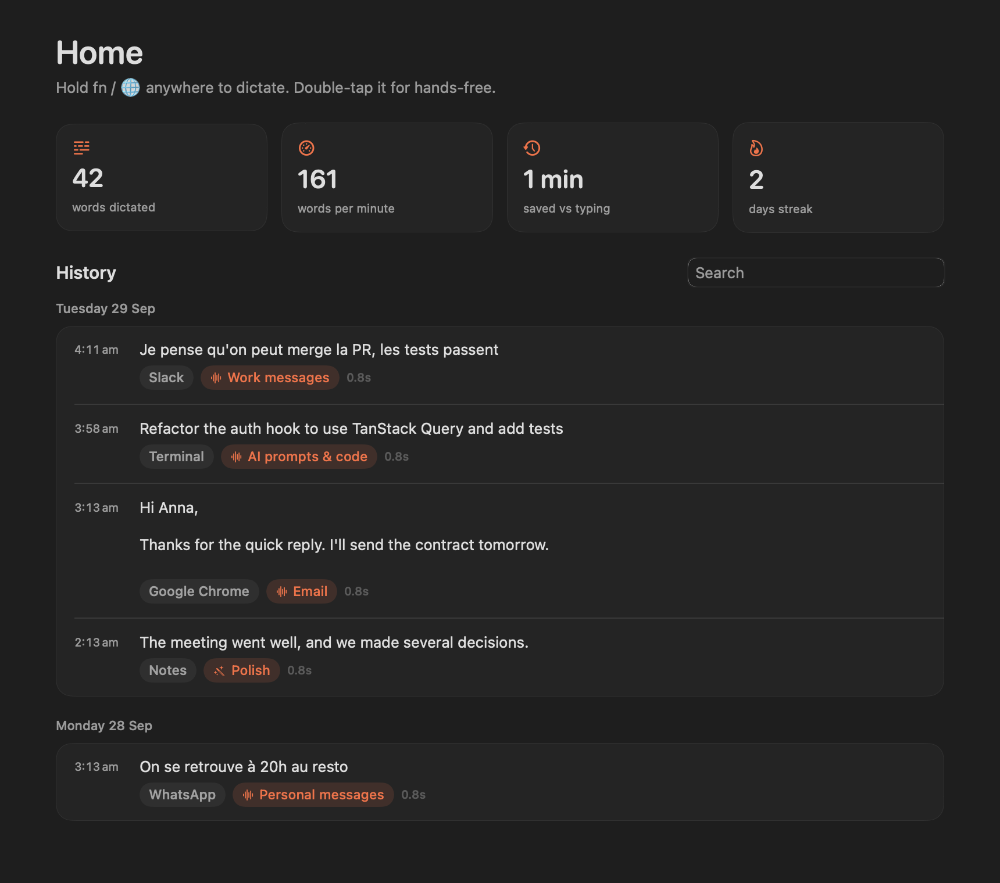
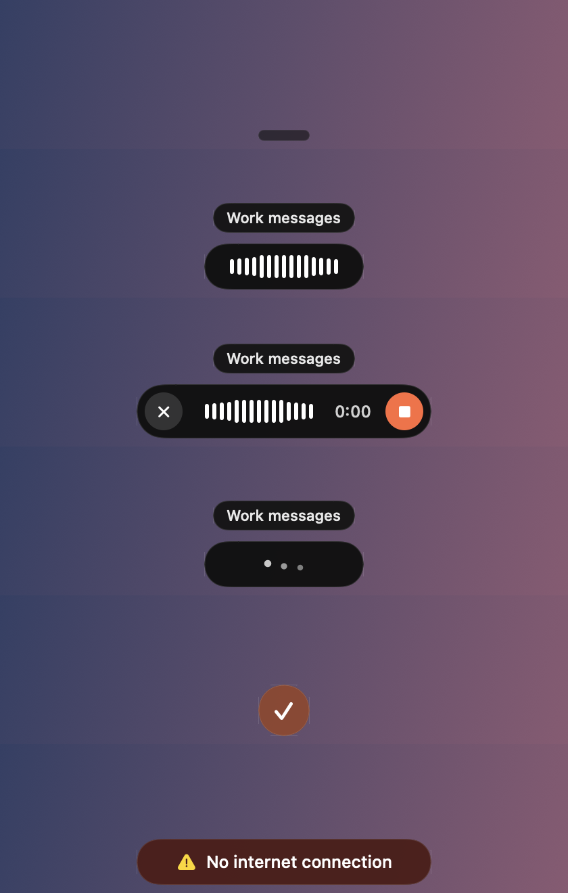
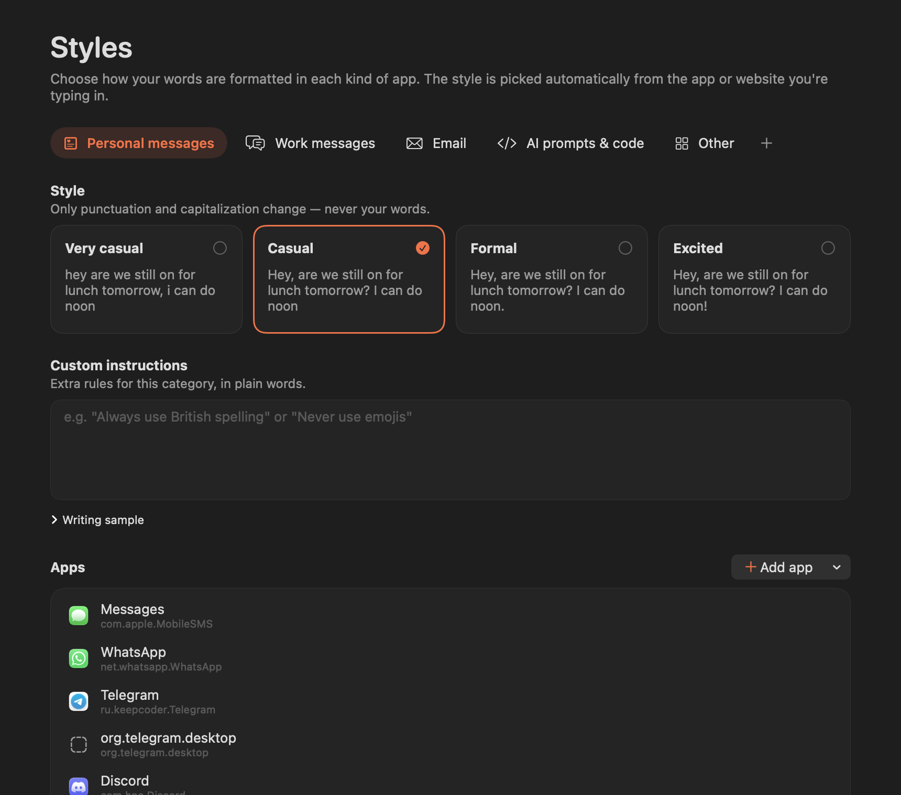

<p align="center">
  
</p>

<h1 align="center">ShukaWhisper</h1>

<p align="center">
  <b>Voice dictation for macOS, powered by your own Gemini API key.</b><br>
  Hold <kbd>fn</kbd>, speak, release. Clean, well-formatted text appears wherever your cursor is.
</p>

<p align="center">
  
</p>

ShukaWhisper is a small, native, open-source alternative to [Wispr Flow](https://wisprflow.ai). It covers the features most people use every day: dictation with AI cleanup, a personal dictionary, per-app writing styles, and text transforms. You bring your own Gemini API key, so it costs a few dollars a month at most.

## Built in under an hour, entirely vibe-coded

This whole project was **vibe-coded in less than an hour** with [Claude Code](https://claude.com/claude-code). No line was written by hand. That covers the research, the model benchmarks, the architecture, the native macOS app, the tests, the logo and this README.

The point isn't the app itself. The point is that **you can do this too**, for almost anything.

We tend to reach for a SaaS subscription every time we need a tool, even when we only use 20% of it and pay for 100%. Building your own version used to take weeks. Today it can take an afternoon, or an hour.

So:

- **Try things.** Got an idea, or annoyed by a tool you pay for every month? Build your own version and see how far you get.
- **Iterate.** The first version doesn't need to be perfect. Use it, notice what bothers you, and fix it. The loop is minutes long now.
- **Learn from what you build.** Read the architecture, ask why a choice was made, break it and fix it. Every small project teaches you something a tutorial won't.

We're lucky to live at a time when trying, iterating and learning have never been this easy. Use it. Fork this repo, bend it to your needs, or start something of your own.

<p align="center">
  
</p>

## Features

- **Dictate anywhere**: hold <kbd>fn</kbd> to talk and release to insert. It works in every app, including terminals, browsers and Electron apps.
- **Hands-free mode**: double-tap <kbd>fn</kbd> for long dictations, then tap again to finish. <kbd>Esc</kbd> cancels.
- **AI cleanup**: filler words ("um", "euh", "like") are removed, self-corrections are resolved ("3pm, no, 4pm" → "4pm"), and punctuation is fixed. Your words are never rewritten.
- **Multilingual**: the language is detected automatically, including switching between French and English mid-sentence. Nothing is ever translated unless you ask for it.
- **Personal dictionary**: names, products and jargon (`Supabase`, `kubectl`, your colleagues) are sent to the recognizer as hints and enforced during cleanup.
- **Styles per app**: *Personal messages*, *Work messages*, *Email*, *AI prompts & code*, *Other*, plus your own categories. Each has a tone preset, custom instructions and an optional writing sample. The style is picked from the frontmost app, **or the browser tab** (Gmail in Chrome counts as *Email*).
- **Transforms**: select text anywhere and press <kbd>⌃⌥1</kbd>…<kbd>⌃⌥9</kbd> to rewrite it in place. Built-ins are *Polish*, *Prompt Engineer*, *Translate to English* and *Make concise*.
- **Voice transform**: select text, hold <kbd>⌃⌥0</kbd> and say what to do ("make this friendlier"). With nothing selected, it writes what you ask for.
- **History and stats**: every dictation is saved locally and searchable, with words per minute, time saved and a day streak.
- **Native and light**: Swift and SwiftUI, a Liquid Glass pill, zero third-party dependencies, about 20 MB of memory.

<p align="center">
  
  &nbsp;&nbsp;
  
</p>

## How it works

```
 hold fn                      release fn                              ~0.9 s
    │                              │                                     │
    ▼                              ▼                                     ▼
 🎙  mic ── 16 kHz PCM ──▶ gemini-3.5-transcribe-live ──▶ gemini-3.5-flash-lite ──▶ ⌘V into the app
          (streamed while            (final transcript           (cleanup + style
           you speak)                 ~0.3 s after release)       for this app, ~0.5 s)
```

Audio is streamed to Gemini **while you speak**, so the transcript is ready about 0.3 s after you release the key. A fast Flash-Lite model then applies cleanup, your dictionary and the style for the current app. If the live connection drops, the recording is sent to the batch transcription API instead, so nothing you said is lost.

The model choices come from a benchmark of five pipelines on French, English and mixed recordings. See [`docs/PLAN.md`](docs/PLAN.md#bake-off-results-2026-09-29).

## Requirements

- macOS 26 (Tahoe) or later
- Swift 6.2: the Xcode Command Line Tools are enough (`xcode-select --install`)
- A [Gemini API key](https://aistudio.google.com/apikey)

## Install

```bash
git clone https://github.com/pierrelissope/shukawhisper.git
cd shukawhisper
make cert      # once: local signing certificate so macOS permissions survive rebuilds
make install   # builds, copies to /Applications and launches
```

On first launch, the app walks you through three steps:

1. **Gemini API key**: pasted and tested, then saved to `~/.config/shukawhisper/key`, readable only by you (like `gh` or `gcloud` credentials). `GEMINI_API_KEY` in the environment takes precedence.
2. **Microphone** access.
3. **Accessibility** access, needed to detect the hotkey, read selected text and paste.

Then set **System Settings › Keyboard › "Press 🌐 key to" → Do Nothing**, so <kbd>fn</kbd> doesn't also open the emoji picker. If you'd rather not use <kbd>fn</kbd>, pick Right ⌥ or Right ⌘ in Settings.

> Running Wispr Flow or another dictation app at the same time? Quit it; both apps would react to <kbd>fn</kbd>.

## Shortcuts

| Shortcut | Action |
|---|---|
| Hold <kbd>fn</kbd> | Dictate; release to insert |
| Double-tap <kbd>fn</kbd> | Hands-free dictation; press <kbd>fn</kbd> again to finish |
| <kbd>Esc</kbd> | Cancel the current dictation or transform |
| <kbd>⌃⌥1</kbd> … <kbd>⌃⌥9</kbd> | Apply a transform to the selected text |
| Hold <kbd>⌃⌥0</kbd> | Voice transform: speak an instruction for the selected text |

Number keys are matched by position, so <kbd>⌃⌥1</kbd> works on AZERTY keyboards too. Plain <kbd>⌥</kbd> + number is left alone so you can still type symbols with it; if you prefer the shorter <kbd>⌥1</kbd>, switch the transform shortcut in Settings.

## Customize

- **Styles**: pick a tone for each category, add instructions in plain words ("Always use British spelling"), and assign apps and websites. The *Other* category catches everything else.
- **Dictionary**: add a word, plus how it's often misheard if you like ("kubectl ← cube control"). Around 100 well-chosen words work best.
- **Transforms**: nine slots, each with a name, instructions and up to five output examples.
- **Settings**: dictation key, language, models, sounds, clipboard restoration, launch at login.

Everything is stored in `~/Library/Application Support/ShukaWhisper/`: `config.json` for settings and `history.sqlite` for history.

## Privacy

- Audio is only captured while you hold the key or are in hands-free mode, and it's only sent to Google's Gemini API. It's never written to disk.
- History, settings and the dictionary stay on your Mac. The API key lives in a private file (`~/.config/shukawhisper/key`, mode 600). The Keychain isn't used: without an Apple Developer ID it asks for your password again after every rebuild.
- The active browser tab's address is read only to pick a style, and only its host (e.g. `mail.google.com`) is used.
- There is no analytics, telemetry or account.

## Cost

At the time of writing, live transcription costs about $0.009 per minute of speech and the cleanup pass costs fractions of a cent. Dictating 30 minutes every working day comes to roughly **$6 a month**; typical use is much less.

## Development

```bash
make test                                    # unit tests
swift build && .build/debug/ShukaWhisper --transcribe sample.wav --bundle com.tinyspeck.slackmacgap
                                             # full pipeline on a 16 kHz mono WAV, with latency breakdown
.build/debug/ShukaWhisper --snapshots out/   # render every screen and pill state to PNG
make run                                     # build the .app and launch it
```

The code is split into three modules:

| Module | What's inside |
|---|---|
| `ShukaCore` | Pure logic: styles, prompts, push-to-talk gesture state machine, configuration, history (SQLite), stats. Fully unit-tested, no UI. |
| `GeminiKit` | Gemini clients: live WebSocket transcription, batch transcription, text generation. |
| `ShukaWhisper` | The app: hotkeys, audio capture, context detection, text insertion, SwiftUI interface. |

[`docs/ARCHITECTURE.md`](docs/ARCHITECTURE.md) explains how a dictation flows through the code, and [`CONTRIBUTING.md`](CONTRIBUTING.md) explains how to contribute.

## Troubleshooting

| Problem | Fix |
|---|---|
| <kbd>fn</kbd> opens the emoji picker or Apple dictation | System Settings › Keyboard › "Press 🌐 key to" → **Do Nothing** |
| Nothing happens when holding <kbd>fn</kbd> | Check that Accessibility is granted in Settings › Permissions. After granting it, quit and relaunch if needed. |
| Permissions asked again after every build | Run `make cert` once, then `make install` |
| Style is always "Other" in the browser | Allow ShukaWhisper to control your browser when macOS asks (Automation permission) |
| "Invalid Gemini API key" | Create a new key at [aistudio.google.com/apikey](https://aistudio.google.com/apikey) and paste it in Settings |

## License

[MIT](LICENSE)
